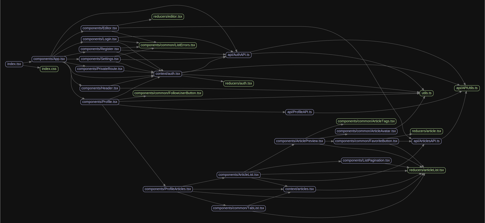

# 源码分析

## 文件结构

``` bash
/Users/liufang/openSource/FunnyLiu/react-hooks-typescript-realworld
├── README.md
├── cypress
|  ├── fixtures
|  |  └── example.json
|  ├── integration
|  |  └── login-spec.js
|  ├── plugins
|  |  └── index.js
|  └── support
|     └── index.js
├── cypress.json
├── logo.png
├── package.json
├── public
|  ├── favicon.ico
|  ├── index.html
|  └── manifest.json
├── src
|  ├── api
|  |  ├── APIUtils.ts
|  |  ├── ArticlesAPI.ts
|  |  ├── AuthAPI.ts
|  |  ├── CommentsAPI.ts
|  |  ├── ProfileAPI.ts
|  |  └── TagsAPI.ts
|  ├── components
|  |  ├── App.tsx
|  |  ├── Article
|  |  |  ├── ArticleActions.tsx
|  |  |  ├── ArticleMeta.tsx
|  |  |  ├── Comment.tsx
|  |  |  ├── CommentContainer.tsx
|  |  |  ├── CommentInput.tsx
|  |  |  ├── DeleteButton.tsx
|  |  |  └── index.tsx
|  |  ├── ArticleList.tsx
|  |  ├── ArticlePreview.tsx
|  |  ├── Editor.tsx
|  |  ├── Header.tsx
|  |  ├── Home
|  |  |  ├── Banner.tsx
|  |  |  ├── MainView.tsx
|  |  |  ├── Tags.tsx
|  |  |  └── index.tsx
|  |  ├── ListPagination.tsx
|  |  ├── Login.tsx
|  |  ├── PrivateRoute.tsx
|  |  ├── Profile.tsx
|  |  ├── ProfileArticles.tsx
|  |  ├── Register.tsx
|  |  ├── Settings.tsx
|  |  └── common
|  |     ├── ArticleAvatar.tsx
|  |     ├── ArticleTags.tsx
|  |     ├── FavoriteButton.tsx
|  |     ├── FollowUserButton.tsx
|  |     ├── ListErrors.tsx
|  |     └── TabList.tsx
|  ├── context
|  |  ├── articles.tsx
|  |  └── auth.tsx
|  ├── index.css
|  ├── index.tsx
|  ├── react-app-env.d.ts
|  ├── reducers
|  |  ├── article.tsx
|  |  ├── articleList.tsx
|  |  ├── auth.tsx
|  |  └── editor.tsx
|  ├── types
|  |  └── index.ts
|  └── utils.ts
├── tsconfig.json
└── yarn.lock

directory: 15 file: 59

ignored

```

## 外部模块依赖

请在： http://npm.broofa.com?q=react-hooks-typescript-realworld 查看

## 内部模块依赖


  